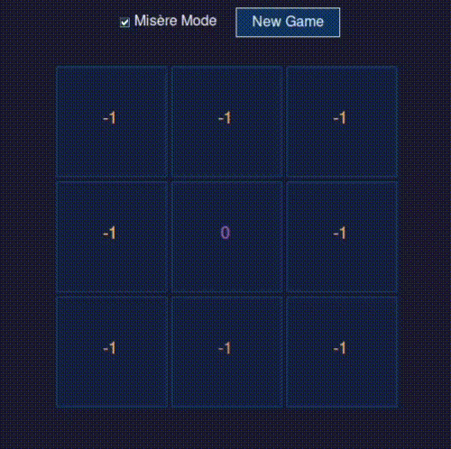

# Anti-XO

> A mini project for my master's qualifying year - Traditional Artificial Intelligence course

Tic-tac-toe but backwards. Lose on purpose. It's harder than it sounds.

## Demo



## What is this?

You know regular tic-tac-toe? Boring, right? Every game ends in a draw if both players have some brain cells.

**Anti-XO (Misère tic-tac-toe)** flips the rules: **getting three-in-a-row makes you LOSE**. Suddenly the game gets interesting.

I made a solver to see what perfect play looks like. Spoiler: it's nothing like regular XO.

## Installation

```bash
pip install pybind11
cd src
c++ -O3 -Wall -shared -std=c++17 -fPIC $(python3 -m pybind11 --includes) xo.cpp -o tictactoe_solver$(python3-config --extension-suffix)
python main.py
```

If that doesn't work, Ask your favorite LLM.

## The Big Difference

### Regular XO
```
Opening move scores: [0, 0, 0, 0, 0, 0, 0, 0, 0]
```
Translation: "Pick whatever. It's a draw. Always."

Corners, edges, center - doesn't matter. The game is solved and boring.

### Anti-XO
```
Opening move scores: [-1, -1, -1, -1, 0, -1, -1, -1, -1]
```
Translation: "Pick center or lose."

**ONLY the center doesn't lose immediately.** Every other opening move leads to a forced loss with perfect play. The game is BRUTAL from move one.

## Why is Anti-XO so different?

In regular XO, you're trying to make lines. In Anti-XO, you're trying to NOT make lines. This completely changes the strategy:

- **Regular XO**: Center and corners are equivalent (all draw)
- **Anti-XO**: Center is the ONLY move that doesn't lose

- **Regular XO**: Symmetry everywhere, safe moves all around  
- **Anti-XO**: Symmetry in despair - corners and edges all lose equally

Here's a mid-game position:
```
Board: X _ _ | _ O _ | _ _ _

Regular XO:  [-, 0, 0, 0, -, 0, 0, 0, 0]  ← "meh, whatever"
Anti-XO:     [-, -1, -1, -1, -, 0, -1, 0, 0]  ← "OH NO OH NO"
```

Same board. Completely different optimal moves.

## What's in the box

- **C++ solver** - minimax with alpha-beta pruning (fast enough)
- **Python GUI** - pretty Tkinter interface with hover effects
- **Both modes** - toggle between regular and anti at runtime
- **Live scores** - see which moves are good/bad in real-time

## GUI Features

- Hover over squares to preview your move
- Scores show up in each empty cell (faded so they're not annoying)
- When someone wins/loses, the three squares light up
  - Green in regular mode (yay!)
  - Red in anti mode (oops!)
- Blue X's, yellow O's, purple zeros
- Dark theme because it's 2024

## Performance

Solves the empty board in ~7ms. Mid-game positions in ~0.003ms. Fast enough that the GUI feels instant.

The game tree has like 255k nodes but alpha-beta pruning does its job.

## How it works

Standard minimax stuff:
- Each board position gets a score
- Positive = good for X, negative = good for O, zero = draw
- In anti mode, just multiply scores by -1 (big brain)
- Prefer faster wins with depth scoring (10 - moves)
- No memoization because depth matters

Board encoding is base-3 (each cell is 0/1/2, so 3^9 possible states).

## Try it

Open the GUI and play anti mode. Try to draw. It's genuinely hard.

The solver will show you that most of your moves are terrible. Don't feel bad - most moves ARE terrible in anti-XO.

## Why did you make this?

Honestly? I was curious if anti tic-tac-toe was as different as people say. Turns out: yes, very.

Also I wanted to learn pybind11 and needed a small project. This seemed fun.

## Files

- `tictactoe_solver.cpp` - the actual solver
- `main.py` - GUI that looks pretty
- `xo.py` - terminal version if you hate GUIs
- `report.py` - nerdy stats I ran

## Contributing

If you want to improve this, go for it. Some ideas:
- Make the AI dumber (add mistakes)
- 4x4 board version
- Actually explain WHY only center works in anti mode
- Web version?

## Final thoughts

Regular tic-tac-toe: solved in 1952, draws forever, put it in a museum

Anti tic-tac-toe: actually interesting, one wrong move and you're cooked, respect the center

---

*Made by someone who was bored and forced to take an undergraduate course again in his master's degree*
